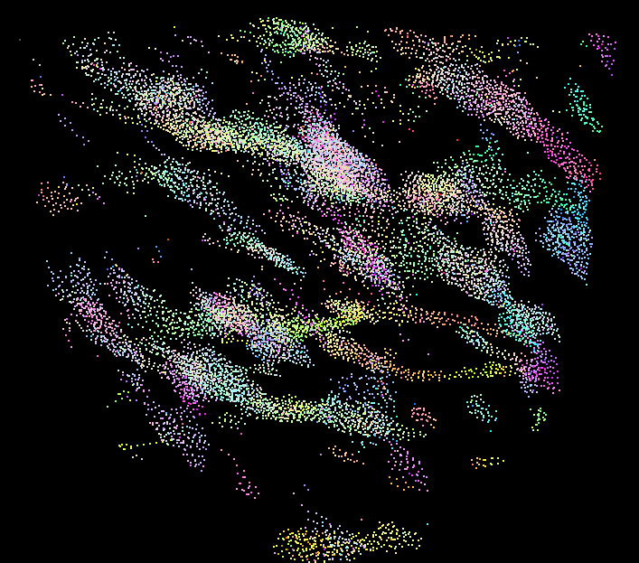

**University of Pennsylvania, CIS 565: GPU Programming and Architecture,
Project 1 - Flocking**

* Gangzheng Tong
  * www.gtong.me
* Tested on: Windows 10, Xeon E5-2687W v3 @ 3.1GHz 64GB, Titan V (Sig Lab)

### 

####
cxxopts.hpp added to CMakeList in order to parse command line argument for testing

## Part 2.2
Compare the uniform grid velocity update to the naive velocity update, I found that with the increased number of objects, the uniform grid velocity performs better than the naive one. As the diagram suggests, once the number of objects exceeds 10000 in this test setting, uniform grid velocity update is generally faster than the naive one.
Part of the reason is due to the naive search linearly goes through all other particles to find the neighbours, and the O(n^2) makes it hard to scale.

## Part 3 Performance Analysis

1. For each implementation, generally speaking, the performance drops as the number of boids increases. However, for uniform scatter and coherent search, the performance increases in the beginning when the number of boids is small. I think it has something to do with the GPU latency and the initial setup required for these more complicated algorithm. But with these optimizations, it’s also more scalable than the naive approach.

2. As the diagram illustrates, changing the blocksize has little impact on the Naive algorithm, but has a positive impact on the uniform scatter and coherent search algorithm. I’m running the test on Titan V GPU, which has huge memory and a large number of SMs. It implies that for the naive algorithm the computation becomes the bottleneck, whereas there is large room for the bandwidth. With the coherent search, we need to do a lot of reshuffles and sorting, this is why the large bandwidth helps.

3. Changing cell width and checking 27 vs 8 neighboring cells has influence on the performance. The result depends on the current state of the boids layout. Generally speaking, if the number of boids is small and the boids are spread out, checking 27 will help improve the performance because we have a higher chance eliminating the empty cells in the first place.

## Part 3 Feedback
It’s tedious to use #define macro to toggle different test settings because we need to re-compile the application and it’s time-consuming. I introduce an AUTOMATION macro and use run-time arguments to control the settings. By doing this, I can use a single batch file (see test.bat for example) to run all setting combinations (num of boids, blockSize, Naive/Scatter/Coherent, etc.). 
The result file will be output and saved to the “output” folder.
For each test, it will run 20s before exit.

It saves me so much time and I’d suggest using the for the future assignment.
I use a third-party argument parsing file “cxxopts.hpp”. It’s added to CMakeList and should be compiled as usual.
 To run the executable from command line, copy the exe file to the same directory as the “shaders” folder in order to find the glsl files.

To disable AUTOMATION, simply change it to #define AUTOMATION 0, and it will run just like the provided version.

Due to the limited time, I will optimize the testing procedure in the upcoming assignment.
